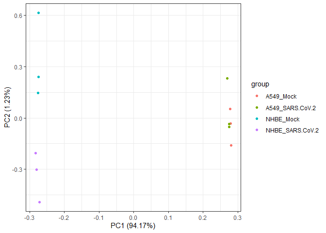
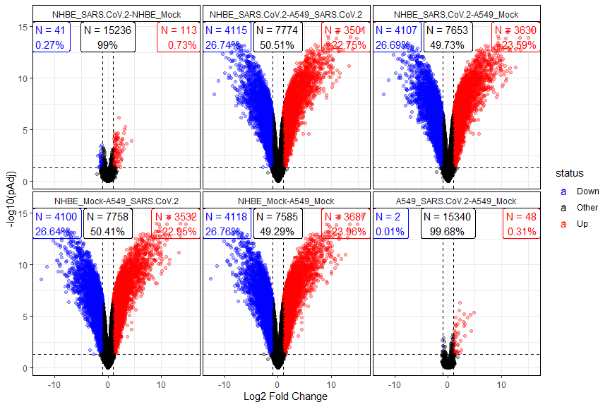

# Biokit 

[](https://travis-ci.com/martingarridorc/biokit)
[](https://codecov.io/gh/martingarridorc/biokit/)
[](https://github.com/martingarridorc/biokit/blob/master/LICENSE)


This package is a toolkit that can be concieved as a wrapper for
functions and utilities that I use repeatedly across projects and
collaborations involving omics data analysis. Particularly, it makes use
of the core functions from packages such as
[limma](https://bioconductor.org/packages/release/bioc/html/limma.html),
[edgeR](https://bioconductor.org/packages/release/bioc/html/edgeR.html)
and
[fgsea](https://bioconductor.org/packages/release/bioc/html/fgsea.html)
to automate processes as the statistical comparison and functional
analysis of omics data.

## Installation

The package can be installed through the `install_github()` function
from
[devtools](https://cran.r-project.org/web/packages/devtools/index.html).

    devtools::install_github(repo = "https://github.com/martingarridorc/biokit")

``` r
library(biokit)
```

    ## Warning: replacing previous import 'dplyr::select' by 'AnnotationDbi::select'
    ## when loading 'biokit'

    ## Warning: replacing previous import 'AnnotationDbi::select' by 'dplyr::select'
    ## when loading 'biokit'

``` r
knitr::opts_chunk$set(
  fig.path = "man/figures/"
)
data("sarsCovData")
data("humanHallmarks")
```

Filter and normalize counts

``` r
sarsCovMat <- sarsCovMat[rowSums(sarsCovMat) >= 15, ]
tmmMat <- countsToTmm(sarsCovMat)
```

Plot value distribution per sample

``` r
biokit::violinPlot(tmmMat)
```

<!-- -->

PCA plot

``` r
biokit::pcaPlot(mat = tmmMat, sampInfo = sarsCovSampInfo, groupCol = "group")
```

<!-- -->

Heatmap of the top 25 most variable genes

``` r
heatmapPlot(mat = tmmMat, sampInfo = sarsCovSampInfo, groupCol = "group",scaleBy = "row",  nTop = 25)
```

<!-- -->

Perform differential expression analysis

``` r
diffRes <- biokit::autoLimmaComparison(mat = tmmMat, sampInfo = sarsCovSampInfo, groupCol = "group")
```

Visualize results with a volcano plot

``` r
biokit::volcanoPlot(diffRes)
```

<!-- -->

Perform functional analysis with GSEA

``` r
gseaResults <- gseaFromStats(df = diffRes, funCatList = humanHallmarks, rankCol = "logFc", splitCol = "comparison")
```

    ## Warning in preparePathwaysAndStats(pathways, stats, minSize, maxSize, gseaParam, : There are ties in the preranked stats (2.2% of the list).
    ## The order of those tied genes will be arbitrary, which may produce unexpected results.

    ## Warning in preparePathwaysAndStats(pathways, stats, minSize, maxSize, gseaParam, : There are ties in the preranked stats (0.58% of the list).
    ## The order of those tied genes will be arbitrary, which may produce unexpected results.

    ## Warning in preparePathwaysAndStats(pathways, stats, minSize, maxSize, gseaParam, : There are ties in the preranked stats (0.43% of the list).
    ## The order of those tied genes will be arbitrary, which may produce unexpected results.

    ## Warning in preparePathwaysAndStats(pathways, stats, minSize, maxSize, gseaParam, : There are ties in the preranked stats (0.73% of the list).
    ## The order of those tied genes will be arbitrary, which may produce unexpected results.

    ## Warning in preparePathwaysAndStats(pathways, stats, minSize, maxSize, gseaParam, : There are ties in the preranked stats (0.42% of the list).
    ## The order of those tied genes will be arbitrary, which may produce unexpected results.

    ## Warning in preparePathwaysAndStats(pathways, stats, minSize, maxSize, gseaParam, : There are ties in the preranked stats (4.55% of the list).
    ## The order of those tied genes will be arbitrary, which may produce unexpected results.

And plot enriched hallmarks

``` r
gseaPlot(gseaResults)
```

<!-- -->

Session information

``` r
sessionInfo()
```

    ## R version 4.0.5 (2021-03-31)
    ## Platform: x86_64-w64-mingw32/x64 (64-bit)
    ## Running under: Windows 10 x64 (build 19042)
    ## 
    ## Matrix products: default
    ## 
    ## locale:
    ## [1] LC_COLLATE=English_United Kingdom.1252 
    ## [2] LC_CTYPE=English_United Kingdom.1252   
    ## [3] LC_MONETARY=English_United Kingdom.1252
    ## [4] LC_NUMERIC=C                           
    ## [5] LC_TIME=English_United Kingdom.1252    
    ## 
    ## attached base packages:
    ## [1] stats     graphics  grDevices utils     datasets  methods   base     
    ## 
    ## other attached packages:
    ## [1] biokit_0.1.1
    ## 
    ## loaded via a namespace (and not attached):
    ##  [1] locfit_1.5-9.4              Rcpp_1.0.6                 
    ##  [3] lattice_0.20-41             tidyr_1.1.3                
    ##  [5] assertthat_0.2.1            digest_0.6.27              
    ##  [7] utf8_1.2.1                  R6_2.5.0                   
    ##  [9] GenomeInfoDb_1.26.4         stats4_4.0.5               
    ## [11] RSQLite_2.2.5               evaluate_0.14              
    ## [13] highr_0.8                   ggplot2_3.3.3              
    ## [15] pillar_1.5.1                zlibbioc_1.36.0            
    ## [17] rlang_0.4.10                data.table_1.14.0          
    ## [19] blob_1.2.1                  S4Vectors_0.28.1           
    ## [21] Matrix_1.3-2                rmarkdown_2.7              
    ## [23] labeling_0.4.2              BiocParallel_1.24.1        
    ## [25] stringr_1.4.0               pheatmap_1.0.12            
    ## [27] RCurl_1.98-1.3              bit_4.0.4                  
    ## [29] munsell_0.5.0               fgsea_1.16.0               
    ## [31] DelayedArray_0.16.3         compiler_4.0.5             
    ## [33] xfun_0.22                   pkgconfig_2.0.3            
    ## [35] BiocGenerics_0.36.0         htmltools_0.5.1.1          
    ## [37] tidyselect_1.1.0            SummarizedExperiment_1.20.0
    ## [39] tibble_3.1.0                gridExtra_2.3              
    ## [41] GenomeInfoDbData_1.2.4      edgeR_3.32.1               
    ## [43] IRanges_2.24.1              matrixStats_0.58.0         
    ## [45] fansi_0.4.2                 crayon_1.4.1               
    ## [47] dplyr_1.0.5                 bitops_1.0-6               
    ## [49] grid_4.0.5                  gtable_0.3.0               
    ## [51] lifecycle_1.0.0             DBI_1.1.1                  
    ## [53] magrittr_2.0.1              scales_1.1.1               
    ## [55] stringi_1.5.3               cachem_1.0.4               
    ## [57] farver_2.1.0                XVector_0.30.0             
    ## [59] limma_3.46.0                ggfortify_0.4.11           
    ## [61] ellipsis_0.3.1              generics_0.1.0             
    ## [63] vctrs_0.3.7                 fastmatch_1.1-0            
    ## [65] RColorBrewer_1.1-2          tools_4.0.5                
    ## [67] bit64_4.0.5                 Biobase_2.50.0             
    ## [69] glue_1.4.2                  purrr_0.3.4                
    ## [71] MatrixGenerics_1.2.1        parallel_4.0.5             
    ## [73] fastmap_1.1.0               yaml_2.2.1                 
    ## [75] AnnotationDbi_1.52.0        colorspace_2.0-0           
    ## [77] GenomicRanges_1.42.0        memoise_2.0.0              
    ## [79] knitr_1.31
