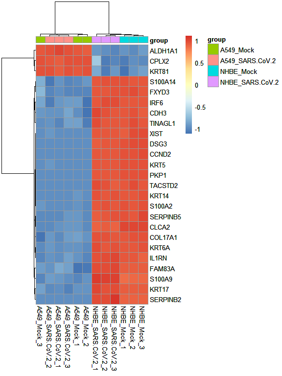

# Biokit 

[](https://travis-ci.com/martingarridorc/biokit)
[](https://codecov.io/gh/martingarridorc/biokit/)
[](https://github.com/martingarridorc/biokit/blob/master/LICENSE)


Biokit is an unified wrapper package for functions and utilities to
perform the analysis of transcriptomic and proteomic data. It contains
several functions to carry out a basic exploratory analysis of the omics
data tables, together with tools to normalize and perform the
differential analysis between the sample groups of interest. In
addition, biokit can also conduct the functional analysis of the results
to reduce its dimensionality and increase its interpretability, using
over-representation analysis (ORA) or functional class scoring (FCS)
approaches.

## Installation

The package can be installed through the `install_github()` function
from
[devtools](https://cran.r-project.org/web/packages/devtools/index.html).

    devtools::install_github(repo = "https://github.com/martingarridorc/biokit")

# Case-of-use

``` r
library(biokit)
data("sarsCovData")
data("humanHallmarks")

# set output directory for images
knitr::opts_chunk$set(
  fig.path = "man/figures/"
)
```

To exemplify the capabilities and features of biokit, we will apply it
to a transcriptomic dataset obtained from the [following GEO
entry](https://www.ncbi.nlm.nih.gov/geo/query/acc.cgi?acc=GSE147507).
This dataset contains a subset of the samples analyzed in this project,
where the reaction from different human cell lines to SARS-COV-2
infection is evaluated using RNA-Seq. The starting materials for the
analysis are:

**The RNA-Seq counts table**

``` r
head(sarsCovMat[, 1:3])
```

    ##           NHBE_Mock_1 NHBE_Mock_2 NHBE_Mock_3
    ## DDX11L1             0           0           0
    ## WASH7P             29          24          23
    ## FAM138A             0           0           0
    ## FAM138F             0           0           0
    ## OR4F5               0           0           0
    ## LOC729737         112         119         113

**A data frame containing the sample group information**

``` r
head(sarsCovSampInfo)
```

    ##                name           group
    ## 1       NHBE_Mock_1       NHBE_Mock
    ## 2       NHBE_Mock_2       NHBE_Mock
    ## 3       NHBE_Mock_3       NHBE_Mock
    ## 4 NHBE_SARS.CoV.2_1 NHBE_SARS.CoV.2
    ## 5 NHBE_SARS.CoV.2_2 NHBE_SARS.CoV.2
    ## 6 NHBE_SARS.CoV.2_3 NHBE_SARS.CoV.2

**And a list containing the MSigDb functional categories, that we will
use for the functional analysis**

``` r
lapply(humanHallmarks[1:10], head)
```

    ## $HALLMARK_ADIPOGENESIS
    ## [1] "ABCA1" "ABCB8" "ACAA2" "ACADL" "ACADM" "ACADS"
    ## 
    ## $HALLMARK_ALLOGRAFT_REJECTION
    ## [1] "AARS"   "ABCE1"  "ABI1"   "ACHE"   "ACVR2A" "AKT1"  
    ## 
    ## $HALLMARK_ANDROGEN_RESPONSE
    ## [1] "ABCC4"   "ABHD2"   "ACSL3"   "ACTN1"   "ADAMTS1" "ADRM1"  
    ## 
    ## $HALLMARK_ANGIOGENESIS
    ## [1] "APOH"   "APP"    "CCND2"  "COL3A1" "COL5A2" "CXCL6" 
    ## 
    ## $HALLMARK_APICAL_JUNCTION
    ## [1] "ACTA1" "ACTB"  "ACTC1" "ACTG1" "ACTG2" "ACTN1"
    ## 
    ## $HALLMARK_APICAL_SURFACE
    ## [1] "ADAM10"   "ADIPOR2"  "AFAP1L2"  "AKAP7"    "APP"      "ATP6V0A4"
    ## 
    ## $HALLMARK_APOPTOSIS
    ## [1] "ADD1"  "AIFM3" "ANKH"  "ANXA1" "APP"   "ATF3" 
    ## 
    ## $HALLMARK_BILE_ACID_METABOLISM
    ## [1] "ABCA1" "ABCA2" "ABCA3" "ABCA4" "ABCA5" "ABCA6"
    ## 
    ## $HALLMARK_CHOLESTEROL_HOMEOSTASIS
    ## [1] "ABCA2" "ACAT2" "ACSS2" "ACTG1" "ADH4"  "ALCAM"
    ## 
    ## $HALLMARK_COAGULATION
    ## [1] "A2M"   "ACOX2" "ADAM9" "ANG"   "ANXA1" "APOA1"

In a first step, we can explore the per-sample value distribution of the
raw counts table. Then, we can filter and normalize the count matrix
using a minimum cutoff of counts across samples, with a default value of
**15**. Then, we can normalize the resulting count matrix with the edgeR
TMM approach, using the `countsToTmm()` function from the biokit.

``` r
biokit::violinPlot(sarsCovMat)
```

<!-- -->

``` r
sarsCovMat <- sarsCovMat[rowSums(sarsCovMat) >= 15, ]
tmmMat <- countsToTmm(sarsCovMat)
```

Next, we can explore the new per-sample value distribution using again
the violin plot function.

``` r
biokit::violinPlot(tmmMat)
```

<!-- -->

In a second exploratory step, we can apply a Principal Component
Analysis (PCA) to reduce the dataset dimensionality and explore the
group distribution in a bidimensional space formed by the first two
principal components.

``` r
biokit::pcaPlot(mat = tmmMat, sampInfo = sarsCovSampInfo, groupCol = "group")
```

<!-- -->

Next, we can explore the top 25 genes with the higuest standard
deviation in teh entire dataset, representing and clustering them
through a heatmap representation.

``` r
heatmapPlot(mat = tmmMat, sampInfo = sarsCovSampInfo, groupCol = "group",scaleBy = "row",  nTop = 25)
```

<!-- -->

Once that we have evaluated the distribution of sample groups and of
most variable genes with basic exploratory analysis, we can perform a
differential expression between the sample groups of interest using the
for the linear models included in the limma package. The `volcanoPlot()`
function can be used to obtain a broad spectrum view of the results for
each of the comparisons carried out.

``` r
diffRes <- biokit::autoLimmaComparison(mat = tmmMat, sampInfo = sarsCovSampInfo, groupCol = "group")
biokit::volcanoPlot(diffRes)
```

<!-- -->

In a final step, we can perform the functional analysis for each
comparison using the GSEA approach and visualize the significant results
using the `gseaPlot()` function.

``` r
gseaResults <- gseaFromStats(df = diffRes, funCatList = humanHallmarks, rankCol = "logFc", splitCol = "comparison")
gseaPlot(gseaResults)
```

<!-- -->

Session information

``` r
sessionInfo()
```

    ## R version 4.0.5 (2021-03-31)
    ## Platform: x86_64-w64-mingw32/x64 (64-bit)
    ## Running under: Windows 10 x64 (build 19042)
    ## 
    ## Matrix products: default
    ## 
    ## locale:
    ## [1] LC_COLLATE=English_United Kingdom.1252 
    ## [2] LC_CTYPE=English_United Kingdom.1252   
    ## [3] LC_MONETARY=English_United Kingdom.1252
    ## [4] LC_NUMERIC=C                           
    ## [5] LC_TIME=English_United Kingdom.1252    
    ## 
    ## attached base packages:
    ## [1] stats     graphics  grDevices utils     datasets  methods   base     
    ## 
    ## other attached packages:
    ## [1] biokit_0.1.1
    ## 
    ## loaded via a namespace (and not attached):
    ##  [1] locfit_1.5-9.4              Rcpp_1.0.6                 
    ##  [3] lattice_0.20-41             tidyr_1.1.3                
    ##  [5] assertthat_0.2.1            digest_0.6.27              
    ##  [7] utf8_1.2.1                  R6_2.5.0                   
    ##  [9] GenomeInfoDb_1.26.4         stats4_4.0.5               
    ## [11] RSQLite_2.2.5               evaluate_0.14              
    ## [13] highr_0.8                   ggplot2_3.3.3              
    ## [15] pillar_1.6.1                zlibbioc_1.36.0            
    ## [17] rlang_0.4.10                data.table_1.14.0          
    ## [19] blob_1.2.1                  S4Vectors_0.28.1           
    ## [21] Matrix_1.3-2                rmarkdown_2.7              
    ## [23] labeling_0.4.2              BiocParallel_1.24.1        
    ## [25] stringr_1.4.0               pheatmap_1.0.12            
    ## [27] RCurl_1.98-1.3              bit_4.0.4                  
    ## [29] munsell_0.5.0               fgsea_1.16.0               
    ## [31] DelayedArray_0.16.3         compiler_4.0.5             
    ## [33] xfun_0.22                   pkgconfig_2.0.3            
    ## [35] BiocGenerics_0.36.0         htmltools_0.5.1.1          
    ## [37] tidyselect_1.1.0            SummarizedExperiment_1.20.0
    ## [39] tibble_3.1.0                gridExtra_2.3              
    ## [41] GenomeInfoDbData_1.2.4      edgeR_3.32.1               
    ## [43] IRanges_2.24.1              matrixStats_0.58.0         
    ## [45] fansi_0.4.2                 crayon_1.4.1               
    ## [47] dplyr_1.0.6                 bitops_1.0-6               
    ## [49] grid_4.0.5                  gtable_0.3.0               
    ## [51] lifecycle_1.0.0             DBI_1.1.1                  
    ## [53] magrittr_2.0.1              scales_1.1.1               
    ## [55] stringi_1.5.3               cachem_1.0.4               
    ## [57] farver_2.1.0                XVector_0.30.0             
    ## [59] limma_3.46.0                ggfortify_0.4.11           
    ## [61] ellipsis_0.3.2              generics_0.1.0             
    ## [63] vctrs_0.3.8                 fastmatch_1.1-0            
    ## [65] RColorBrewer_1.1-2          tools_4.0.5                
    ## [67] bit64_4.0.5                 Biobase_2.50.0             
    ## [69] glue_1.4.2                  purrr_0.3.4                
    ## [71] MatrixGenerics_1.2.1        parallel_4.0.5             
    ## [73] fastmap_1.1.0               yaml_2.2.1                 
    ## [75] AnnotationDbi_1.52.0        colorspace_2.0-0           
    ## [77] GenomicRanges_1.42.0        memoise_2.0.0              
    ## [79] knitr_1.31
